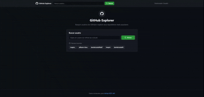

# GitHub Explorer

Aplicação client-side para explorar usuários e repositórios do GitHub, desenvolvida como solução do desafio técnico Front-End da [Desbravador Software](https://github.com/DesbravadorSoftware/desafioFront).

## Demo

**Aplicação publicada:** [https://github-explorer-desafio.vercel.app](https://github-explorer-desafio.vercel.app)

**Repositório:** [https://github.com/allisson-lima/github-explorer-desafio](https://github.com/allisson-lima/github-explorer-desafio)

### Demonstração



---

## Sobre o projeto

O GitHub Explorer permite buscar um usuário do GitHub, visualizar seu perfil e explorar seus repositórios públicos com ordenação, filtros, paginação e acesso aos detalhes de cada repositório.

### Funcionalidades

- Busca de usuários do GitHub com validação de formulário
- Exibição de perfil (avatar, bio, seguidores, seguindo, e-mail e repositórios públicos)
- Listagem de repositórios ordenável por estrelas, nome, data de atualização e forks
- Busca local na listagem de repositórios (nome, descrição e linguagem)
- Paginação com controle de itens por página
- Página de detalhes do repositório com link externo para o GitHub
- Buscas recentes persistidas no navegador
- Tratamento de erros da API com status HTTP e mensagem retornada
- Layout responsivo para desktop e mobile
- Busca global disponível no header em todas as páginas

### Requisitos do desafio atendidos

| Requisito | Implementação |
| --- | --- |
| Aplicação client-side | React + Vite (SPA) |
| Rotas | React Router v7 |
| Consumo da API GitHub | Axios + TanStack Query |
| Layout responsivo | Tailwind CSS v4 |
| Busca de usuário | Formulário com validação |
| Detalhes do usuário | Avatar, bio, seguidores, seguindo, e-mail |
| Listagem de repositórios | Ordenação decrescente por estrelas (padrão) |
| Alteração da ordenação | Select + estado na URL (`nuqs`) |
| Detalhes do repositório | Nome, descrição, estrelas, linguagem e link externo |

---

## Stack tecnológica

| Tecnologia | Uso |
| --- | --- |
| [React 19](https://react.dev/) | Interface e componentes |
| [TypeScript](https://www.typescriptlang.org/) | Tipagem estática |
| [Vite 8](https://vite.dev/) | Build tool e dev server |
| [React Router v7](https://reactrouter.com/) | Roteamento client-side |
| [TanStack Query](https://tanstack.com/query) | Cache e fetching de dados |
| [Axios](https://axios-http.com/) | Cliente HTTP |
| [Zod](https://zod.dev/) | Validação de schemas e respostas da API |
| [React Hook Form](https://react-hook-form.com/) | Formulários |
| [nuqs](https://nuqs.dev/) | Query params na URL (sort, page, busca) |
| [Zustand](https://zustand.docs.pmnd.rs/) | Histórico de buscas recentes |
| [Tailwind CSS v4](https://tailwindcss.com/) | Estilização responsiva |
| [Lucide React](https://lucide.dev/) | Ícones |
| [Vitest](https://vitest.dev/) + [Testing Library](https://testing-library.com/) | Testes unitários e de componentes |
| ESLint + Prettier + Husky + lint-staged | Qualidade e padronização de código |

---

## Estrutura do projeto

```text
src/
├── components/
│   ├── layout/       # Header, Footer, PageContainer
│   ├── search/       # Formulário de busca e buscas recentes
│   ├── user/         # Perfil do usuário
│   ├── repos/        # Listagem, cards, paginação e filtros
│   ├── repo/         # Detalhes do repositório
│   └── ui/           # Componentes reutilizáveis (Button, Input, Card...)
├── constants/        # Constantes da aplicação
├── hooks/            # React Query hooks e lógica de listagem
├── lib/              # QueryClient e utilitários gerais
├── pages/            # Páginas por rota
├── providers/        # Providers globais (Query, Router, nuqs)
├── schemas/          # Schemas Zod
├── services/         # Axios e integração com GitHub API
├── stores/           # Zustand stores
├── types/            # Tipos TypeScript
├── utils/            # Funções auxiliares
└── test/             # Setup Vitest, helpers de render e mocks
    ├── setup.ts
    ├── test-utils.tsx
    └── mocks/
```

---

## Pré-requisitos

- [Node.js](https://nodejs.org/) 20 ou superior
- [npm](https://www.npmjs.com/)

---

## Instalação

Clone o repositório e instale as dependências:

```bash
git clone https://github.com/allisson-lima/github-explorer-desafio.git
cd github-explorer-desafio
npm install
```

---

## Variáveis de ambiente

Copie o arquivo de exemplo:

```bash
cp .env.example .env
```

| Variável | Obrigatória | Descrição |
| --- | --- | --- |
| `VITE_GITHUB_TOKEN` | Não | Token pessoal do GitHub para aumentar o rate limit da API (60 para 5000 req/h). [Criar token](https://github.com/settings/tokens) - nenhum escopo é necessário para dados públicos. |

---

## Executando o projeto

### Desenvolvimento

```bash
npm run dev
```

Acesse [http://localhost:5173](http://localhost:5173).

### Build de produção

```bash
npm run build
```

### Preview do build

```bash
npm run preview
```

---

## Testes

A suíte usa **Vitest** + **Testing Library**, organizada em camadas:

| Camada | Escopo | Exemplos |
| --- | --- | --- |
| Unitários | Funções puras e validação | `filterRepos`, `sortRepos`, `searchSchema`, `getApiErrorDetails` |
| Store / Service | Estado e integração API | `search-store`, `github-service`, interceptors Axios |
| Componentes | UI e fluxos do usuário | `SearchForm`, `UserProfile`, `RepoList`, `UserPage` |

### Executar testes

```bash
npm test              # watch (desenvolvimento)
npm run test:run      # execução única
npm run test:coverage # com cobertura
```

### Escopo coberto

| Funcionalidade | O que é testado |
| --- | --- |
| Busca de usuário | Validação Zod, submit, navegação, buscas recentes |
| Perfil do usuário | Renderização de avatar, bio, stats e fallbacks |
| Listagem de repositórios | Filtro local, ordenação, paginação, estados vazios |
| Detalhes do repositório | Nome, descrição, link externo |
| Erros da API | Mapeamento 404/403 para mensagens amigáveis |
| Buscas recentes | Persistência, deduplicação, limite de 5 itens |

### Qualidade no Git (Husky)

| Hook | Verificação |
| --- | --- |
| `pre-commit` | ESLint + Prettier nos arquivos staged; `vitest related` em arquivos de teste alterados |
| `pre-push` | Prettier check → suite completa de testes → build de produção |

### CI (GitHub Actions)

Na branch `main`, o workflow [`.github/workflows/ci.yml`](.github/workflows/ci.yml) executa automaticamente em **push** e **pull requests**:

| Etapa | Comando |
| --- | --- |
| Lint | `npm run lint` |
| Formatação | `npm run prettier:check` |
| Testes | `npm run test:run` |
| Build | `npm run build` |

---

## Scripts disponíveis

| Script | Descrição |
| --- | --- |
| `npm run dev` | Inicia o servidor de desenvolvimento |
| `npm run build` | Gera o build de produção |
| `npm run preview` | Visualiza o build localmente |
| `npm run lint` | Executa o ESLint |
| `npm run lint:fix` | Corrige problemas do ESLint automaticamente |
| `npm run prettier:format` | Formata os arquivos com Prettier |
| `npm run prettier:check` | Verifica a formatação dos arquivos |
| `npm test` | Executa testes em modo watch |
| `npm run test:run` | Executa todos os testes uma vez (CI / pre-push) |
| `npm run test:coverage` | Executa testes com relatório de cobertura |

---

## Rotas

| Rota | Descrição |
| --- | --- |
| `/` | Página inicial com busca de usuário |
| `/user/:username` | Perfil do usuário e listagem de repositórios |
| `/repo/:owner/:repoName` | Detalhes de um repositório |
| `*` | Página 404 |

### Query params (listagem de repositórios)

| Param | Descrição | Exemplo |
| --- | --- | --- |
| `sort` | Campo de ordenação | `stars`, `name`, `updated`, `forks` |
| `order` | Direção | `asc`, `desc` |
| `q` | Busca local | `react` |
| `page` | Página atual | `2` |
| `perPage` | Itens por página | `6`, `10`, `20`, `50` |

Exemplo: `/user/octocat?sort=stars&order=desc&q=hello&page=1&perPage=10`

---

## APIs consumidas

| Endpoint | Descrição |
| --- | --- |
| `GET /users/{username}` | Detalhes do usuário |
| `GET /users/{username}/repos` | Repositórios do usuário (com paginação automática) |
| `GET /repos/{owner}/{repo}` | Detalhes de um repositório |

Documentação: [GitHub REST API](https://docs.github.com/en/rest)

---

## Deploy

O projeto está configurado para deploy na [Vercel](https://vercel.com):

- **Build command:** `npm run build`
- **Output directory:** `dist`
- **SPA rewrite:** configurado em `vercel.json`

Também é compatível com [Netlify](https://netlify.com) via `public/_redirects`.

---

## Decisões técnicas

- **React + TypeScript:** alinhado à vaga e garante tipagem em toda a aplicação
- **Tailwind CSS em vez de Bootstrap:** layout responsivo equivalente com utilitários modernos e bundle menor
- **TanStack Query:** cache de 5 minutos reduz chamadas à API e melhora a navegação entre páginas
- **Zod na camada de service:** valida o contrato das respostas da API antes de chegar à UI
- **nuqs:** mantém ordenação, paginação e busca na URL - links compartilháveis e estado persistente ao recarregar
- **Tratamento de erros tipado:** exibe status HTTP (404, 403...) e mensagem retornada pela API do GitHub
- **Vitest + Testing Library:** runner nativo ao Vite; testes focados no comportamento do usuário, não em implementação interna
- **Husky + lint-staged:** garante padronização de código no commit e executa a suíte completa de testes no push
- **GitHub Actions:** valida lint, formatação, testes e build na branch `main` a cada push ou PR

---

## Autor

**Allisson Lima**

- GitHub: [@allisson-lima](https://github.com/allisson-lima)

---

## Licença

Este projeto foi desenvolvido para fins de avaliação técnica.
